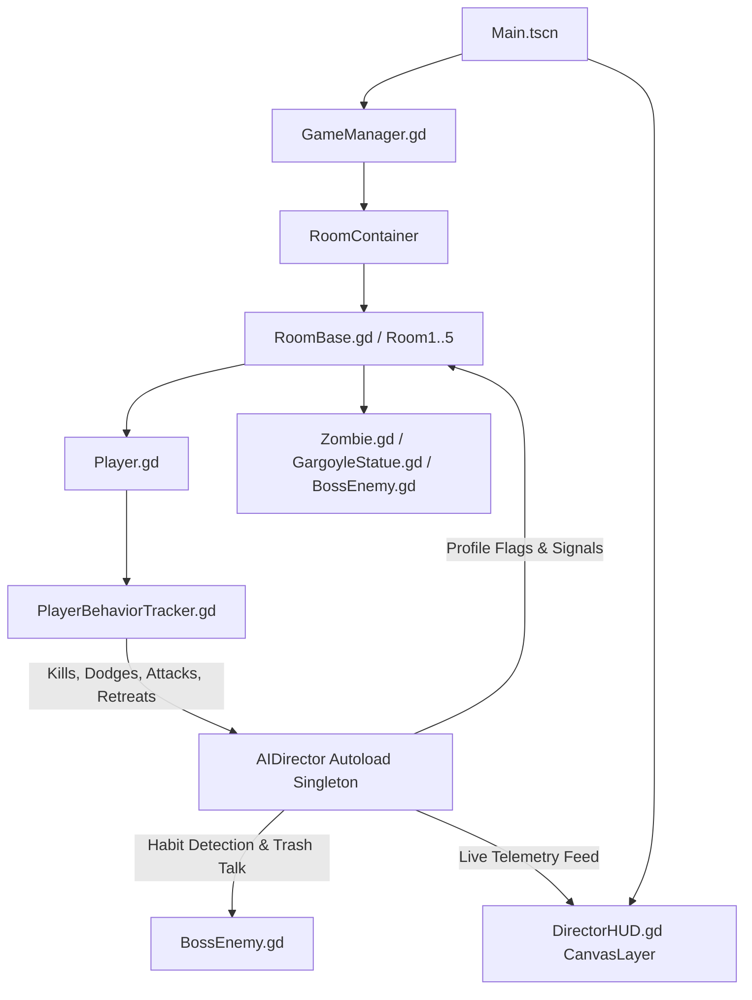

# 🎮 Skill Issue: Adaptive AI Dungeon Crawler
## Project Progress, Architecture & Developer Handoff Guide

> **Document Version:** 1.0  
> **Engine:** Godot 4.4 Stable (2D Top-Down Action RPG)  
> **Primary Goal:** Pair a retro top-down dungeon crawler with a dynamic **AI Director** that passively analyzes player combat habits (dodge bias, retreat tendencies, attack rhythm, aggression) and adapts intermediate dungeon rooms and the Adaptive Final Boss in real-time.

---

## 📑 Table of Contents
1. [High-Level Architecture Overview](#1-high-level-architecture-overview)
2. [What Has Been Built & Completed](#2-what-has-been-built--completed)
3. [Dungeon Rooms & Progression Flow](#3-dungeon-rooms--progression-flow)
4. [Enemy & Combat Systems](#4-enemy--combat-systems)
5. [AI Director & Telemetry Integration (For the AI Dev)](#5-ai-director--telemetry-integration-for-the-ai-dev)
6. [Adaptive Final Boss (Room 5) Contract](#6-adaptive-final-boss-room-5-contract)
7. [Assets & Sprite Sheet Inventory](#7-assets--sprite-sheet-inventory)
8. [Quick Debug Keys & Testing Controls](#8-quick-debug-keys--testing-controls)
9. [Active Next Steps for AI / Learning Implementation](#9-active-next-steps-for-ai--learning-implementation)

---

## 1. High-Level Architecture Overview



---

## 2. What Has Been Built & Completed

### A. Core Engine & Room Infrastructure
- **Full Screen 1280×720 Dungeon Visuals**: 5 custom pixel-art room backgrounds mapped from `res://assets/room1_bg.png` through `room5_bg.png`.
- **Perimeter Dungeon Colliders**: Built dynamically via `StaticBody2D` with authentic boundary collision boxes.
- **Interactive Doorway & Archway Portals**: North exit door unlocks upon room clearance; dual phasing archways teleports actors across opposite walls.
- **Room Timer Punishment**: Rooms trigger secondary threats (e.g. awakening corner gargoyles) if the player takes too long.
- **Windows WASAPI Audio Stability**: Configured low-latency output settings to eliminate audio buffer drops.

### B. Player Controller (`scripts/player.gd`)
- **8-Directional Top-Down Movement**: Smooth WASD / Arrow movement (Speed: 210 px/s).
- **Player Marker Visual**: Vibrant cyan core dot with yellow aim/facing directional indicator.
- **Combat Mechanics**: Left-click / `J` / `Z` melee weapon swing (25 damage, hit feedback, attack cooldown).
- **Dash & Dodge Roll**: `Shift` / Right Click / `C` burst dash; reports directional telemetry to `AIDirector`.
- **Ice Drift Momentum (`apply_ice_effect`)**: Dynamic physics modifier for icy surface rooms.
- **Auto-Tracker Attachment**: Spawns and manages `PlayerBehaviorTracker` as a child node.

### C. Enemy System (`scripts/zombie.gd` & `scripts/gargoyle_statue.gd`)
- **Multi-Enemy Archetypes**: Goblins, Skeletons, Armored Skeletons, Dark Cultists, and Winged Gargoyles.
- **Directional Animation Engine**: `AnimatedSprite2D` dynamically plays `walk_down`, `walk_side`, `walk_up`, `attack_down`, `attack_side`, `attack_up`, `idle_down`, `idle_side`, and `idle_up`.
- **Soft Separation Physics**: Boids-style separation steering prevents enemy stacking and eliminates hard physics pinning on player contact.
- **Melee Combat**: Close-range strike lunges with visual windup, cooldown, and gentle recoil.
- **Ranged Combat & Projectiles (`scripts/projectile.gd`)**: Spawns flying poison bombs, dark orbs, and spears.
- **Gargoyle Corner Statues**: Dormant stone traps positioned in all 4 dungeon room corners that awaken into flying combatants.

---

## 3. Dungeon Rooms & Progression Flow

| Room | Scene / Script | Theme & Modifier | Behavior / AI Integration |
|---|---|---|---|
| **Room 1** | `room_1_tutorial.tscn`<br>`room1_tutorial.gd` | **Tutorial ("Welcome, Hero")** | Teaches WASD move, aim, click attack, dash. Spawns 3 baseline goblins. No Director interference. |
| **Room 2** | `room_2_icy.tscn`<br>`room2_icy.gd` | **Icy Floor ("Something is Wrong")** | Low-friction ice zone covering center floor (`apply_ice_effect(0.92)`). Mixed skeleton & goblin spawns. |
| **Room 3** | `room_3_faster.tscn`<br>`room3_faster.gd` | **Speed Scaling ("Combat")** | Fast charging enemies (1.55× speed). If `AIDirector.is_aggressive`, spawns 2 extra enemies. |
| **Room 4** | `room_4_director.tscn`<br>`room4_director.gd` | **The Director Room ("The Dungeon Learns")** | Reactive environment: dynamically spawns flankers on dodge habits, spawns ice on retreats, speeds up on attack rhythms. |
| **Room 5** | `room_5_boss.tscn`<br>`room5_boss.gd` | **Adaptive Final Boss ("Dark Wizard")** | 5-phase adaptive boss that reads the player's full session profile and trash-talks their habits. |

---

## 4. Enemy & Combat Systems

### Animation Frames Directory Structure
Located in `res://assets/anims/`:
```
res://assets/anims/
├── goblin/            (60 frames: r0=down walk, r1=side walk, r2=up walk, r3..r5=attacks)
├── skeleton/          (59 frames: idle, walk, sword swing, shield block)
├── armored_skeleton/  (60 frames: heavy plate walk, cleave, shield block)
├── gargoyle/          (58 frames: stone dormant, flight walk, claw slash, slam)
├── dark_cultist/      (60 frames: hooded walk, bomb throw, dark orb cast)
└── dark_wizard/       (60 frames: levitation, spell cast, firebomb, energy burst)
```

### Collision Layers
- **Layer 1**: Player & Dungeon Perimeter Walls
- **Layer 2**: Enemies (`CharacterBody2D`)
- **Mask 1**: Environment walls (`StaticBody2D`)

---

## 5. AI Director & Telemetry Integration (For the AI Dev)

The `AIDirector` (`autoload/AIDirector.gd`) is an Autoload Singleton globally accessible across all scripts.

### A. Raw Metrics Tracked
```gdscript
var kills: int = 0
var dodge_counts: Dictionary = {"left": 0, "right": 0, "up": 0, "down": 0}
var retreat_time: float = 0.0
var attack_timestamps: Array[float] = []
```

### B. Derived Profile Flags
```gdscript
var dominant_dodge: String       # "left" | "right" | "up" | "down" | ""
var is_aggressive: bool          # True if KPM >= 4.0
var is_retreater: bool           # True if total retreat time >= 12.0s
var attack_is_rhythmic: bool     # True if attack intervals have low variance (< 0.18s std dev)
```

### C. Signals Emitted by the Director
You can connect to these signals anywhere (e.g., in room scripts or boss states):
```gdscript
AIDirector.player_is_aggressive.connect(_on_aggressive)
AIDirector.player_is_retreater.connect(_on_retreater)
AIDirector.player_dodge_pattern_detected.connect(_on_dodge_pattern) # Passes (direction: String)
AIDirector.attack_rhythm_detected.connect(_on_rhythm)
```

### D. Telemetry Ingestion Methods
* **Record Kill**: `AIDirector.record_kill()` (called on enemy death)
* **Record Attack**: `AIDirector.record_attack()` (called on player weapon swing)
* **Record Dodge**: `AIDirector.record_dodge(direction: String)` (called on player dash)
* **Record Retreat**: `AIDirector.record_retreat(delta: float)` (called continuously by `PlayerBehaviorTracker` when backing away from nearest enemy)

---

## 6. Adaptive Final Boss (Room 5) Contract

The final boss (`scripts/boss_enemy.gd`) runs a 5-stage state machine:

1. **`MONOLOGUE`**: Intro speech teasing the player's observed run.
2. **`OBSERVING`**: Circles the player, evaluates dominant habits.
3. **`AGGRESSIVE`**: Rushes player with melee & arcane bursts.
4. **`ADAPTIVE`**:
   - If player has `dominant_dodge`: Pre-fires projectiles anticipating the dodge direction.
   - If player is `is_retreater`: Uses closing gap-closers and projectile traps.
   - If player has `attack_is_rhythmic`: Counter-attacks between expected attack beats.
   - Displays context-sensitive trash-talk dialogue above head.
5. **`ENRAGED`** (HP < 25%): Maximum speed, bullet-hell bursts, and frantic attacks.

---

## 7. Assets & Sprite Sheet Inventory

All visual assets reside in `res://assets/`:

| File Name | Purpose | Dimensions |
|---|---|---|
| `skeleton_spritesheet.png` | Skeleton Warrior walk & swing frames | 1376×768 (Transparent) |
| `goblin_spritesheet.png` | Goblin spear thrust & walk frames | 1376×768 (Transparent) |
| `armored_skeleton_spritesheet.png` | Armored Skeleton Knight frames | 1376×768 (Transparent) |
| `gargoyle_spritesheet.png` | Winged Gargoyle stone & flight frames | 1376×768 (Transparent) |
| `dark_cultist_spritesheet.png` | Hooded Cultist bomb & spell frames | 1376×768 (Transparent) |
| `dark_wizard_spritesheet.png` | Final Boss Wizard spell frames | 1376×768 (Transparent) |
| `room1_bg.png` .. `room5_bg.png` | Full 1280×720 room backgrounds | 1280×720 PNG |
| `archway.png`, `door_frame_open.png` | Dungeon portal props | Clean PNGs |

*(Note: Magenta `#FF00FF` versions of all sheets are preserved as `*_magenta.png` if raw chroma keys are needed).*

---

## 8. Quick Debug Keys & Testing Controls

| Key / Input | Action |
|---|---|
| `W`, `A`, `S`, `D` / `Arrows` | Move Player (8-directional) |
| `Left Click` / `J` / `Z` | Attack swing (deals 25 dmg) |
| `Shift` / `Right Click` / `C` | Dash / Dodge Roll |
| `N` or `Space` | **[Debug] Skip to next room** |
| `K` | **[Debug] Kill all enemies in current room** |

---

## 9. Active Next Steps for AI / Learning Implementation

1. **Expand Boss Adaptation Logic (`scripts/boss_enemy.gd`)**:
   - Plug custom machine learning / heuristic algorithms into the `ADAPTIVE` state.
   - Add specialized counters for ranged vs. melee player tendencies.
2. **Director HUD Customization (`scripts/director_hud.gd`)**:
   - Connect additional visual debug charts / real-time telemetry meters in the HUD layer.
3. **Sound Effects & Polish**:
   - Wire additional attack and hit SFX into enemy animation keyframes.
